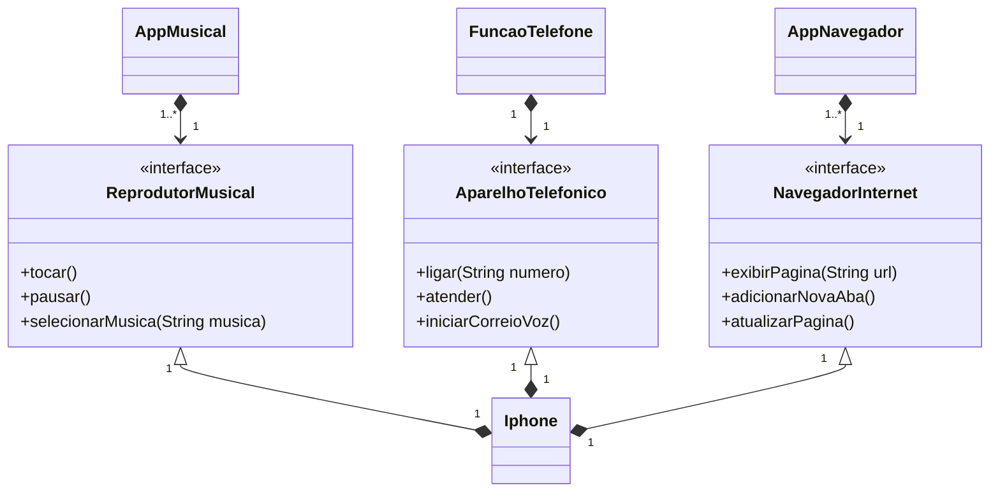

## trilha-java-basico, Resolvendo a UML Iphone

```mermaid    
    classDiagram
      direction BT
      Iphone "1" *--|> "1"ReprodutorMusical
      Iphone "1" *--|> "1" AparelhoTelefonico
      Iphone "1" *--|> "1" NavegadorInternet
      ReprodutorMusical "1 "<-- * "1..*"AppMusical
      AparelhoTelefonico "1"<-- * "1" FuncaoTelefone
      NavegadorInternet "1 " <-- * "1..*"AppNavegador

      class ReprodutorMusical{
        <<interface>>
        +tocar()
        +pausar()
        +selecionarMusica(String musica)
      }
    
      class AparelhoTelefonico{
        <<interface>>
        +ligar(String numero)
        +atender()
        +iniciarCorreioVoz()
      }
      class NavegadorInternet{
        <<interface>>
        +exibirPagina(String url)
        +adicionarNovaAba()
        +atualizarPagina()
      }
```